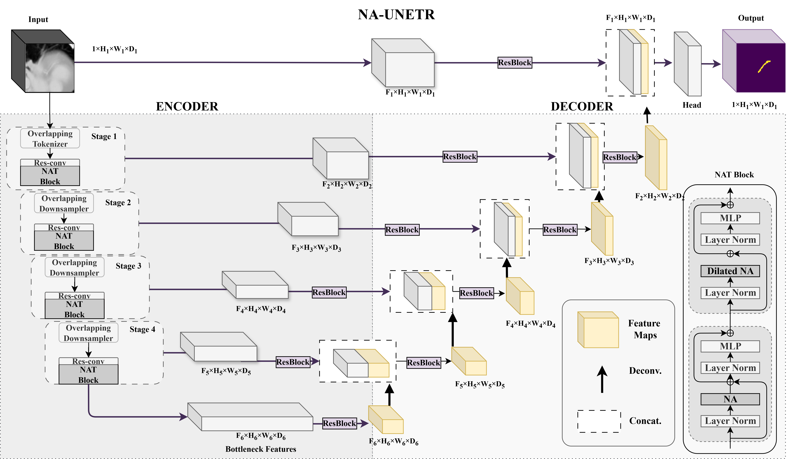
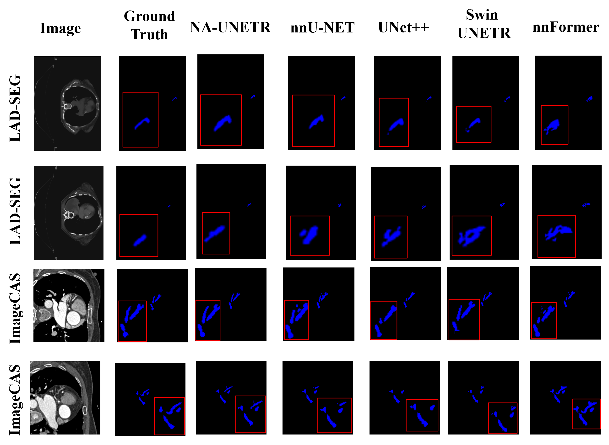

# NA-UNETR

> **A Neighborhood Attention Transformer Network for Enhanced 3D Segmentation of the Left Anterior Descending Artery**

> Rafi Ibn Sultan, Chengyin Li, Yiannos Demetriou, Ahmed I. Ghanem, Joshua P. Kim, Justine Cunningham, Hassan Bagher-Ebadian, Dongxiao Zhu, and Kundan S. Thind  
> Accepted for publication in **Medical Physics**  
> Paper link: Coming soon

NA-UNETR is a 3D transformer-based framework for segmenting the left anterior descending (LAD) artery in free-breathing, non-contrast CT. It combines local structural modeling, long-range contextual reasoning, and uncertainty-guided optimization to address the low contrast, severe class imbalance, and anatomical variability of this clinically important structure.

---

## Abstract

Accurate segmentation of the LAD artery in free-breathing, non-contrast CT is important for cardiac dose assessment and dose sparing in thoracic radiotherapy. However, the LAD is extremely small, has poorly defined boundaries, and varies substantially across patients, making both manual and automatic delineation difficult.

We introduce **NA-UNETR**, a 3D transformer-based segmentation framework that integrates Neighborhood Attention (NA) and Dilated Neighborhood Attention (DiNA) to capture fine anatomical details and long-range spatial context. The model is pretrained on coronary CT angiography and adapted to a limited set of institutional non-contrast CT scans using parameter-efficient fine-tuning. A composite Dice-Focal and Hausdorff objective, dynamically balanced through homoscedastic uncertainty, improves both regional overlap and boundary accuracy. The resulting framework provides an efficient approach to thin-structure segmentation for cardiac substructure analysis in radiotherapy planning.

---

## Method Highlights

- **Local-global context modeling:** Neighborhood Attention captures fine structural details, while Dilated Neighborhood Attention expands the receptive field for longer-range anatomical context.
- **Data-efficient adaptation:** Pretraining on coronary CT angiography transfers general coronary anatomy to the limited-data non-contrast CT setting.
- **Parameter-efficient fine-tuning:** Low-Rank Adaptation (LoRA) reduces the number of trainable parameters during task-specific adaptation.
- **Uncertainty-guided optimization:** Homoscedastic uncertainty dynamically balances overlap- and boundary-focused segmentation objectives.
- **Thin-structure-aware processing:** Artery-centric sampling, contrast enhancement, and morphological refinement support segmentation of the small and low-contrast LAD artery.

---


## Architecture


<p align="center">
  
</p>

<p align="center">
  <em>Overview of the proposed NA-UNETR architecture.</em>
</p>


## Qualitative Results


<p align="center">
  
</p>

<p align="center">
  <em>Qualitative comparison of LAD segmentation results on representative non-contrast CT scans.</em>
</p>


## Repository Structure

```text
NAUNETR/
|
|-- Figures/                # Architecture and qualitative-result figures
|   |-- architecture.png
|   `-- qualitative_results.png
|-- MONAI/                  # MONAI-based components and utilities
|-- instructions.md        # Training and evaluation instructions
|-- main.py                # Main execution entry point
|-- models.py              # NA-UNETR model definitions
`-- requirements.txt       # Python dependencies
```

---

## Installation

Clone the repository and enter the project directory:

```bash
git clone https://github.com/rafiibnsultan1/NAUNETR.git
cd NAUNETR
```

We recommend creating an isolated Python environment before installing the dependencies:

```bash
conda create -n naunetr python=3.10 -y
conda activate naunetr
pip install -r requirements.txt
```

Ensure that the installed versions of PyTorch, CUDA, and NATTEN are mutually compatible with your system.

---

## Usage

Detailed instructions for data preparation, training, and evaluation are provided in [`instructions.md`](instructions.md).

The main entry point is:

```bash
python main.py
```

Configure the required dataset paths and experiment settings according to `instructions.md` before running the code.

---

## Data and Model Weights

This repository does **not** distribute datasets or pretrained model weights.

- Users must obtain and prepare compatible imaging data independently.
- Institutional data used in the study are not included in this release.
- Checkpoints produced during training remain local to the user and are not provided through this repository.

The released code is intended to document the implementation and support reproducibility for users with appropriately prepared data.

---

## Citation

If you find this work useful, please cite:

```bibtex
@article{ibnsultan2026naunetr,
  author  = {Ibn Sultan, Rafi and Li, Chengyin and Demetriou, Yiannos and Ghanem, Ahmed I. and Kim, Joshua P. and Cunningham, Justine and Bagher-Ebadian, Hassan and Zhu, Dongxiao and Thind, Kundan S.},
  title   = {A Neighborhood Attention Transformer Network for Enhanced {3D} Segmentation of the Left Anterior Descending Artery},
  journal = {Medical Physics},
  year    = {2026},
  note    = {Accepted for publication}
}
```

The citation will be updated with the final volume, issue, page range, and DOI once the article is published.

---

## Acknowledgments

This work builds on the Neighborhood Attention mechanism introduced in:

- Ali Hassani, Steven Walton, Jiachen Li, Shen Li, and Humphrey Shi. [**Neighborhood Attention Transformer**](https://openaccess.thecvf.com/content/CVPR2023/html/Hassani_Neighborhood_Attention_Transformer_CVPR_2023_paper.html). *Proceedings of the IEEE/CVF Conference on Computer Vision and Pattern Recognition (CVPR)*, 2023.

We thank the authors for making their research publicly available.
